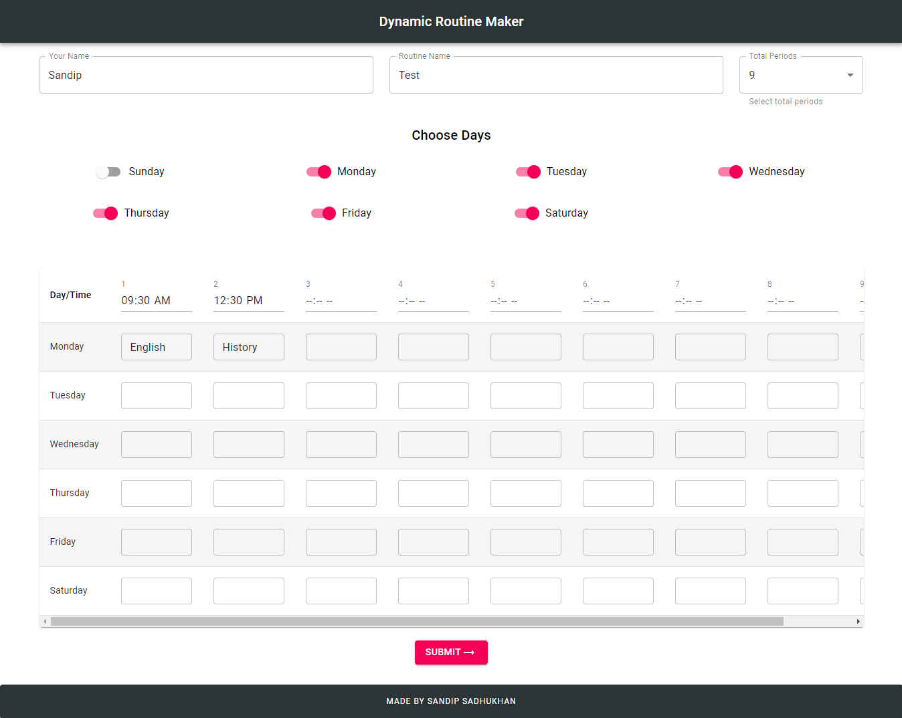

# Dynamic Routine
It is a MERN stack web app. You just put your whole routine in the website and it will create a public link of your routine, that can be accessed accross over the internet.  And the interesting part is that It will show routine  of the perticular day that day when you open it.

<b>Live Link - https://dynamicroutine.netlify.app </b>

## Screenshot

## Technology used
- ReactJs
- Material Ui Framework
- Nodejs
- Express js
- MongoDB
- Netlify ( for frontend deploy )
- Heroku ( for backend deploy )

## Developer
Sandip Sadhukhan
Mail - sandip.sendme@gmail.com
